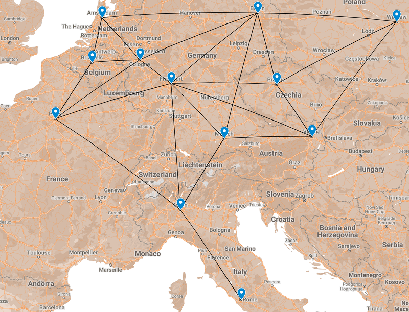
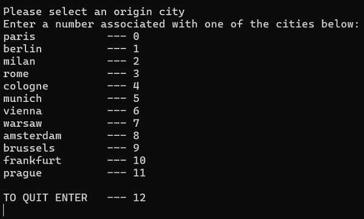

# Mapping Distances between European Cities

CS5008 Spring 2023

Homework 9 - Graphs

Kay (Mengxian) Cai

## Introduction

The map of Europe (as shown below) includes the distances in kilometers along train routes between each city of interest.  These city pairs and distance values are collected in the file `city.dat`.



The goal of this assignment is to read and parse the supplied data from `city.dat`, create a representation of a graph of cities using either an adjacency matrix or an adjacency list, and create a list of cities for selection by the user to check if an edge exists between two cities. 



## How to Run
To build and run the program:
```bash
make
./hw9 city.dat
```

To clean up and remove the compiled files:
```bash
make clean
```